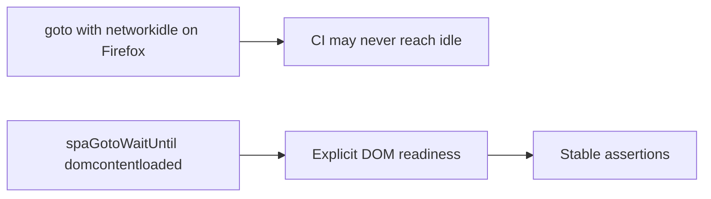

# CI Firefox page.goto networkidle Timeout

## Summary

Firefox tests in CI (e.g. user-journey: theme switching, view documentation, mobile navigation flow) failed with `TimeoutError: page.goto: Timeout 60000ms exceeded` when using `waitUntil: 'networkidle'`. The root cause: in GitHub Actions the page often never reaches "network idle" (ongoing requests, prefetch, or SPA behavior), so the wait never resolves.

## Impact

- Failures on Firefox in CI (e.g. Playwright Shard 3/5): "complete user journey: theme switching and navigation", "complete user journey: view documentation", "complete user journey: mobile navigation flow".
- Other specs still use `networkidle` for Firefox and could hit the same 60s timeout if CI timing changes.

## Root Cause

1. **networkidle semantics:** Playwright's `networkidle` waits until there are no more than 0 network connections for 500ms. In CI, this condition is often not met for this SPA (prefetch, analytics, or sustained requests can keep connections open).
2. **Historical preference:** The repo previously preferred `networkidle` for Firefox for local reliability (see [CI Playwright UI Timeouts](ci-playwright-ui-timeouts.md)), which helped avoid interacting before the page was fully settled. In CI the opposite problem occurs: the page never becomes "idle", so the wait times out.

## Contributing Factors

- SPA and static assets may trigger ongoing or delayed requests.
- CI runners have different load and timing than local runs; Firefox's network-idle behavior can differ.
- No single "wait strategy" doc that distinguished local vs CI for Firefox.

## Resolution / Fix

1. In the failing tests, use `waitUntil: 'domcontentloaded'` for **all** browsers (including Firefox).
2. Rely on existing `waitForFunction` (e.g. for `#content`, `data-content-loaded`, `#homeBanner`) to stabilize assertions after navigation.
3. **Applied in** `tests/user-journey.spec.ts` for:
   - "complete user journey: theme switching and navigation"
   - "complete user journey: view documentation"
   - "complete user journey: mobile navigation flow"
4. The "complete user journey: browse portfolio" test already used `domcontentloaded` for all browsers with a comment that networkidle often never fires in CI for Firefox.

## Why This Approach

Ensures CI passes without changing app behavior. Explicit content waits (e.g. `waitForFunction` for `#content` and `data-content-loaded`) are the same pattern used elsewhere (e.g. chromium-iphone response-then-DOM); here we only change the initial `page.goto` wait so it does not block on network idle.

## Prevention

- For any test that runs in CI with Firefox and does `page.goto('/')` (or similar): use `spaGotoWaitUntil()` from `tests/nav-wait.ts` and follow with explicit `waitForFunction` / `waitForSelector` for the content under test.
- Do not use `networkidle` on `page.goto` for this SPA in CI. For optional quiet-network checks after load, use `tryWaitNetworkIdleBounded(page, ms)` from `tests/nav-wait.ts`.
- Link this post-mortem from [UI_TESTING.md](../UI_TESTING.md) and [testing/README.md](../testing/README.md) so the guideline is discoverable.

## Action Items

- [x] Link this post-mortem from UI_TESTING.md and testing README.
- [x] Unified Firefox and other browsers on `spaGotoWaitUntil()` / `domcontentloaded` for `page.goto` across UI specs (see `tests/nav-wait.ts`).
