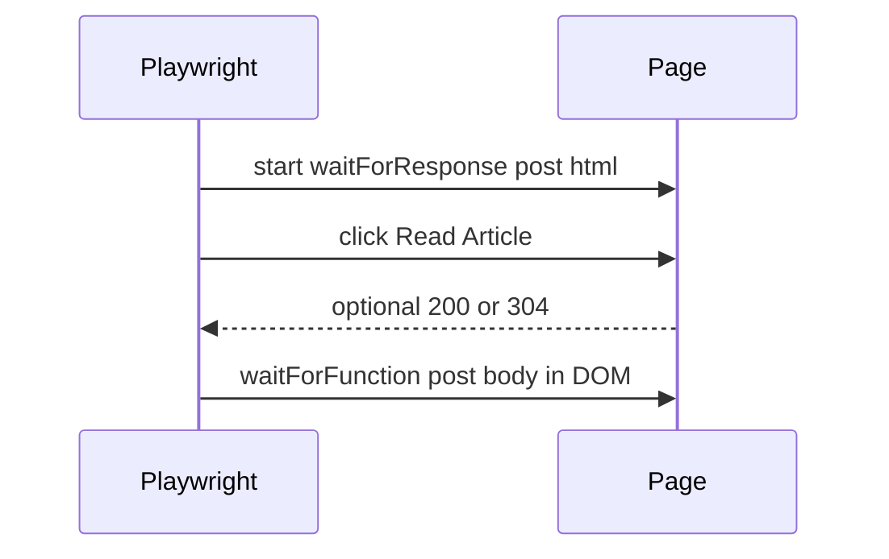

# Blog Page Testing

## Overview

The blog has two listing pages (Engineering and Personal), reached from the Blog dropdown in the main nav. The Engineering page shows a Featured Post, a "Latest Insights" section with a **search bar**, and a grid of blog post cards (real articles). The Personal page uses the same layout with "Coming Soon" placeholders throughout. Users can type text in the search bar to see closest-matching articles (semantic or keyword-based via the API).

## Structure

### Engineering (`html/pages/engineering.html`)

- **Featured Post**: Hero section with real post title, short description, "Read Article" button, and metadata (date, read time). Links use SPA `inline-load` and `data-url="html/pages/engineering/accessibility-is-not-just-a-feature.html"` (featured).
- **Latest Insights**: Section heading (h2), subtitle, and a **search bar**. Typing in the search bar (debounced) calls `GET /api/search?q=...` and shows or hides cards by relevance. When the search box is empty, all cards are shown. When the user empties the search box (e.g. backspace to delete all text, or press Escape), the full grid is restored: any "Coming soon" placeholder cards reappear if present, or all real post cards when there are no placeholders. "No matching articles" is shown when the query returns no results.
- **Blog cards grid**: Three real cards ordered newest → oldest with image, category, date, title, description, tags, and "Read more" link. Cards have `data-article-id` for search matching.

### Personal (`html/pages/lifestyle.html`)

- **Featured Post**: Same hero layout with "Coming Soon" for title and description (no CTA).
- **Latest Insights**: Same section and search bar (search uses the same API; when all cards are placeholders, a query shows "No matching articles").
- **Blog cards grid**: Three placeholder cards with "Coming Soon".

### Post detail page (article view)

When a post is opened (e.g. from Engineering "Read Article" or a card’s "Read more" link), the post HTML is loaded into `#content` via the SPA.

E2E tests should follow **response-then-DOM** (see [CI Chromium-iPhone SPA Flakiness](../Post-Mortem/ci-chromium-iphone-spa-flakiness.md) and `waitForSpaHtmlFragmentResponse` in `tests/nav-wait.ts`):



- **Structure**: Banner image at top (`.post-banner`, `.post-banner-img`), then `.post-hero` (`.post-meta` for date/category/read time and `.post-title`), then `#post-body` (article content: paragraphs, h2s, lists, blockquotes).
- **Listen (read aloud)**: When the post has enough text, a Web Speech toolbar may appear above `#post-body`. See **[Article listen](../ARTICLE_LISTEN.md)** for UX, exclusions (e.g. Mermaid/code), and `tests/article-listen.spec.ts` (including SPA “back to listing” while playing, which must call `speechSynthesis.cancel`).
- **Styling**: Banner has shadow, max-height, and rounded corners; post meta uses secondary text color; blockquotes use accent left border, background, and padding; body has spacing for h2s, paragraphs, and lists. Both `html/css/blog.css` and `html/css/modern.css` apply (posts link both).
- **Entry points**: Reached via SPA from Engineering "Read Article" or from the first card’s "Read more" link.

### Styling

- **Blog CSS** (`html/css/blog.css`): Featured hero, Latest Insights, category pills, and card grid styles. Dark mode: CTA button and "Read more" link use explicit colors (e.g. white for CTA, lighter blue for "Read more") so text stays visible.

## Navigation

- **Blog dropdown** (desktop and mobile): Opens Engineering and Personal links. Active state shows when on either blog page.a
- **From Engineering**: "Read Article" (Featured) or a card’s "Read more" link loads the full post into `#content` via the SPA (no full page reload).

## E2E Test Coverage

`**tests/blog.spec.ts`** covers:

- Engineering page loads via Blog dropdown (desktop and mobile).
- Personal page loads via Blog dropdown (desktop and mobile).
- Engineering page structure: Featured Post (real title, "Read Article" link), Latest Insights (h2, search bar visible), and the full set of real cards. Typing in the search bar filters cards by API results; emptying the search box (or Escape) restores the full card grid. Dedicated tests: **Clearing search restores full card grid**, **Escape clears search and restores full card grid**.
- Personal page structure: Featured and Latest Insights with search bar present; three placeholder cards with "Coming Soon".
- Navigation: Clicking "Read Article" from Engineering loads the post body in `#content` (SPA).
- Post detail structure: banner, hero (meta + title), article body, and at least one blockquote visible when post is loaded in SPA.
- Dark mode: "Read Article" button has visible text when theme is dark.

**Stability (chromium-iphone / CI):** Blog tests that navigate to Engineering or load a post use a **wait-for-response-then-DOM** pattern: they wait for the SPA request (e.g. `engineering.html`, an article `.html`) to complete before waiting for DOM content. This reduces flakiness on the chromium-iphone project in CI. See [Post-Mortem: CI Chromium-iPhone SPA Flakiness](../Post-Mortem/ci-chromium-iphone-spa-flakiness.md).

**Other specs that touch blog:**

- `**tests/article-listen.spec.ts`**: Opens an engineering post via SPA, starts Listen (playing), then uses the post’s **Back to Engineering** link; asserts `speechSynthesis.cancel` runs again (no stale playback on listing).
- `**tests/translation.spec.ts`**: Navigates to Engineering, clicks post link, and asserts translated post title and body in Spanish.
- `**tests/navbar.spec.ts**`: Asserts Blog dropdown and Engineering/Personal links are visible.

## Running Blog Tests

```bash
# Run all blog tests
npx playwright test tests/blog.spec.ts

# Run in a specific browser
npx playwright test tests/blog.spec.ts --project=chromium
npx playwright test tests/blog.spec.ts --project=chromium-iphone
npx playwright test tests/blog.spec.ts --project=firefox

# Run with UI (interactive)
npx playwright test tests/blog.spec.ts --ui
```

