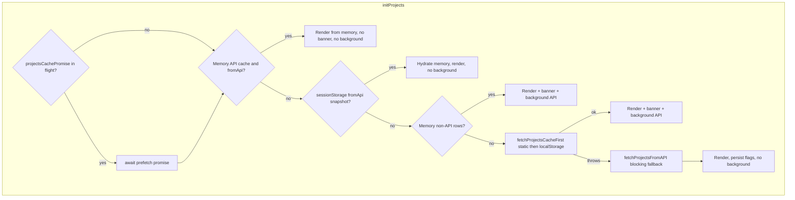
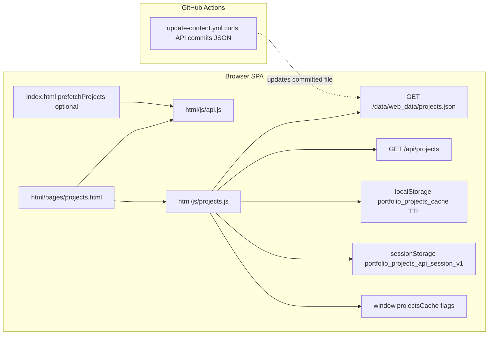

# Projects Endpoint Testing — /api/projects

## Overview

Returns projects merged from GitHub public repos and curated `data/projects.json`. Falls back to curated only if GitHub fails or rate-limits.

## Committed static JSON (repo)

The file `data/web_data/projects.json` (served as `/data/web_data/projects.json`) is the **cache-first** source for the Projects page cold path. It is **not** updated by browser JavaScript. Updates are produced by the **Update Site Content** workflow (`.github/workflows/update-content.yml`), which runs on a schedule, `workflow_dispatch`, and on pushes that touch curated API data paths.

## Frontend loading (Projects page) — cold paint + background API

### Runtime flow (cold vs warm)



### Architecture (modules, stores, CI)



1. **`html/js/api.js`**: `fetchProjectsCacheFirst()` (static, then TTL localStorage), `fetchProjectsFromAPIBackground()` (API only), `fetchProjectsWithFallback()` / `fetchProjects()` for blocking paths, `persistProjectsApiSnapshot()` after a successful API refresh, keys `portfolio_projects_cache` and `portfolio_projects_api_session_v1`.
2. **`html/js/projects.js`**: `initProjects` branches warm vs cold, `startProjectsBackgroundRefresh` (guarded by `__projectsBackgroundRefreshPending`), `projectsDataEqual` / `projectFingerprint` for order-insensitive diff vs the rows that were painted, `removeProjectFallbackNotesFromContent` / `insertProjectsFallbackNote` for at most one banner.
3. **Prefetch**: `index.html` may call `prefetchProjects()`; if `window.projectsCachePromise` exists, `initProjects` awaits it first so the cold path does not fight an in-flight primary fetch.

### Background refresh outcomes

After cache-first (or stale-memory) paint, `fetchProjectsFromAPIBackground()` runs once per guarded invocation. On **success**: the fallback note is removed; if the API list is **order-insensitive equal** to what was shown (`projectsDataEqual`), the DOM is left as-is and snapshots are persisted so revisits skip the cold banner. If the API list **differs**, `renderProjects` runs again, then snapshots persist. On **empty API data, failure, or network error**, the painted list and banner (if any) stay; see Playwright cases in `tests/projects.spec.ts`.

## Positive tests

```bash
curl -s http://localhost:8080/api/projects
```

- Expect 200 JSON array.
- Each item has: `slug`, `name`, `summary`, `repo`, optional `tech`, `featured` (default false).
- Featured sorted first, then by name.

## Negative tests

```bash
# Force missing/invalid token still OK (should fallback or continue)
unset GH_TOKEN
curl -s -i http://localhost:8080/api/projects
```

- Expect 200 and non-empty list (curated fallback is acceptable if GitHub rate-limits).

## Validation/merge behavior

- If the same repo exists in curated and GitHub, curated fields (e.g., summary, featured) should override GitHub when present.
- Curated-only projects not on GitHub should still appear in the final list.

## Performance tests

```bash
# Quick burst
for i in {1..20}; do curl -s http://localhost:8080/api/projects > /dev/null; done
```

- Expect no errors; latency stable.

## E2E tests

- Front-end projects view renders list correctly using this endpoint.
- Traces/screenshots in CI (Playwright) should link to this endpoint without flakiness.
- **Cold static then API**: With prefetch disabled in the test, static JSON paints first; when `/api/projects` returns, the list updates to API rows and the fallback note is cleared (`tests/projects.spec.ts`: *Projects cold-paints static then replaces with API when background succeeds*).
- **Slow or failing API**: When the API is slow or errors, static fallback still yields visible cards (`tests/projects.spec.ts`: *Projects waits for API then uses static fallback when API is slow or errors* — first paint is cache-first; background may still fail).
- **API beats static**: When both static JSON and API return data, the UI ends on the API list (`tests/projects.spec.ts`: *Projects list prefers API over static file when both are available*).
- **One successful `/api/projects` per tab session pattern**: After a successful API-backed session, revisits use session/memory without a second API call (`tests/projects.spec.ts`: *Projects SPA revisit does not call API again when tab session cache exists*).
- **Mermaid / AI tutorial**: Flowchart labels that include `:` must use quoted text in diagram source; see `docs/MERMAID.md` and `tests/mermaid.spec.ts`. For how this interacted with static assets and repeated errors, see [Post-Mortem: static assets, Mermaid, and projects loading](../Post-Mortem/static-assets-repeated-errors-mermaid-projects.md).

## Security tests

- CORS is limited to `https://rickym270.github.io` on other controllers; verify front-end origin access works as expected.
- No secrets are exposed in payload.
